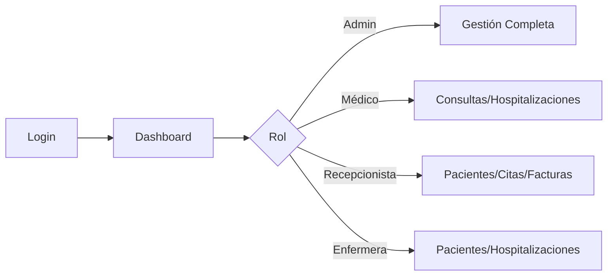

# 🏥 Sistema de Gestión Hospitalaria

<div align="center">


**Sistema integral de gestión hospitalaria con arquitectura moderna**

[Inicio Rápido](#-inicio-rápido) •
[Documentación](#-documentación) •
[Características](#-características) •
[API](#-api-rest) •
[Demo](#-demo)

</div>

---

## 📋 Tabla de Contenidos

- [Descripción](#-descripción)
- [Características](#-características)
- [Tecnologías](#-tecnologías)
- [Inicio Rápido](#-inicio-rápido)
- [Estructura](#-estructura-del-proyecto)
- [API REST](#-api-rest)
- [Módulos](#-módulos)
- [Usuarios](#-usuarios-de-prueba)
- [Documentación](#-documentación)
- [Contribuir](#-contribuir)
- [Licencia](#-licencia)

---

## 🎯 Descripción

Sistema completo de gestión hospitalaria que permite administrar:

- 👥 **Pacientes** e historias clínicas
- 📅 **Citas médicas** con especialistas
- 👨‍⚕️ **Médicos** y especialidades
- 🏥 **Consultas** y diagnósticos
- 🛏️ **Hospitalizaciones** y habitaciones
- 💰 **Facturación** y pagos
- 🔐 **Usuarios** y seguridad
- 📊 **Bitácora** de auditoría

---

## ✨ Características

### Backend (Spring Boot)

- ✅ API REST completa
- ✅ Autenticación JWT
- ✅ Spring Security con roles
- ✅ JPA/Hibernate ORM
- ✅ MySQL como base de datos
- ✅ Validación de datos
- ✅ Manejo de excepciones
- ✅ CORS configurado

### Frontend (React)

- ✅ Interfaz moderna con Material-UI
- ✅ Autenticación con JWT
- ✅ Rutas protegidas por roles
- ✅ Context API para estado global
- ✅ Componentes reutilizables
- ✅ Diseño responsivo
- ✅ Dashboard interactivo

### Seguridad

- 🔒 Autenticación JWT
- 🔐 Contraseñas encriptadas (BCrypt)
- 👤 4 roles de usuario
- 📝 Bitácora de acciones
- 🛡️ Validación de permisos

---

## 🛠️ Tecnologías

<table>
<tr>
<td align="center" width="33%">

### Backend

  
  
  
  
  


</td>
<td align="center" width="33%">

### Frontend

  
  
  
  
  


</td>
<td align="center" width="33%">

### Herramientas

  
  
  
  


</td>
</tr>
</table>

---

## 🚀 Inicio Rápido

### Requisitos Previos

```bash
☑️ JDK 17+
☑️ Maven 3.6+
☑️ Node.js 16+
☑️ MySQL 8.0+
```

### Instalación Rápida

```bash
# 1. Clonar repositorio
git clone <repo-url>
cd evaluacion02

# 2. Crear base de datos
mysql -u root -p
CREATE DATABASE hospital_db;
exit;

# 3. Iniciar Backend (Terminal 1)
cd backend
mvn spring-boot:run

# 4. Iniciar Frontend (Terminal 2)
cd frontend
npm install
npm start
```

### Script Automático

```bash
./setup.sh
```

### Acceder

- 🌐 **Frontend**: http://localhost:3000
- 🔌 **Backend**: http://localhost:8080/api
- 📊 **Base de Datos**: localhost:3306/hospital_db

---

## 📁 Estructura del Proyecto

```
evaluacion02/
├── backend/                    # Spring Boot API
│   ├── src/main/java/
│   │   └── com/hospital/
│   │       ├── entity/        # 17 Entidades JPA
│   │       ├── repository/    # 17 Repositorios
│   │       ├── service/       # 7 Servicios
│   │       ├── controller/    # 8 Controladores REST
│   │       ├── security/      # JWT + Spring Security
│   │       ├── dto/           # Data Transfer Objects
│   │       └── config/        # Configuración
│   └── src/main/resources/
│       ├── application.properties
│       └── data.sql          # Datos iniciales
│
├── frontend/                  # React App
│   └── src/
│       ├── components/       # Componentes reutilizables
│       ├── pages/            # Páginas principales
│       ├── services/         # API Services
│       ├── context/          # Context API
│       └── App.js
│
└── docs/                     # Documentación completa
```

---

## 🔌 API REST

### Endpoints Principales

```http
# Autenticación
POST   /api/auth/login                    # Login
POST   /api/auth/register                 # Registro

# Pacientes
GET    /api/pacientes                     # Listar
GET    /api/pacientes/{id}                # Por ID
POST   /api/pacientes                     # Crear
PUT    /api/pacientes/{id}                # Actualizar
DELETE /api/pacientes/{id}                # Eliminar

# Citas
GET    /api/citas                         # Listar
GET    /api/citas/medico/{id}/fecha/{date}  # Por médico y fecha
POST   /api/citas                         # Crear
PATCH  /api/citas/{id}/estado             # Cambiar estado

# Médicos
GET    /api/medicos                       # Listar
POST   /api/medicos                       # Crear

# Consultas
GET    /api/consultas/paciente/{id}       # Por paciente
POST   /api/consultas                     # Crear

# Hospitalizaciones
GET    /api/hospitalizaciones/activas     # Activas
POST   /api/hospitalizaciones             # Crear
PATCH  /api/hospitalizaciones/{id}/alta   # Dar de alta

# Facturas
GET    /api/facturas/estado/{estado}      # Por estado
POST   /api/facturas                      # Crear
PATCH  /api/facturas/{id}/pagar           # Marcar pagado

# Usuarios (Admin)
GET    /api/admin/usuarios                # Listar
POST   /api/admin/usuarios                # Crear
```

📖 Ver [API_DOCUMENTATION.md](./API_DOCUMENTATION.md) para más detalles

---

## 🧩 Módulos

<table>
<tr>
<td align="center" width="25%">

### 👥 Pacientes

- CRUD completo
- Historia clínica automática
- Antecedentes médicos
- Búsqueda avanzada

</td>
<td align="center" width="25%">

### 📅 Citas

- Agendar citas
- Reprogramar
- Cancelar
- Estados

</td>
<td align="center" width="25%">

### 👨‍⚕️ Médicos

- Gestión de médicos
- Especialidades N:N
- Disponibilidad

</td>
<td align="center" width="25%">

### 🏥 Consultas

- Registro de consultas
- Diagnósticos
- Recetas médicas

</td>
</tr>
<tr>
<td align="center" width="25%">

### 🛏️ Hospitalización

- Control de camas
- Ingreso/Alta
- Estados de habitación

</td>
<td align="center" width="25%">

### 💰 Facturación

- Generación de facturas
- Detalle de servicios
- Control de pagos

</td>
<td align="center" width="25%">

### 👤 Usuarios

- 4 roles
- Permisos
- Gestión (Admin)

</td>
<td align="center" width="25%">

### 📊 Dashboard

- Estadísticas
- Resumen
- Acceso rápido

</td>
</tr>
</table>

---

## 👥 Usuarios de Prueba

<table>
<tr>
<th>Usuario</th>
<th>Contraseña</th>
<th>Rol</th>
<th>Permisos</th>
</tr>
<tr>
<td><code>admin</code></td>
<td><code>password123</code></td>
<td>🔴 Administrador</td>
<td>Acceso completo</td>
</tr>
<tr>
<td><code>dr.garcia</code></td>
<td><code>password123</code></td>
<td>🔵 Médico</td>
<td>Consultas, Hospitalizaciones</td>
</tr>
<tr>
<td><code>recepcion1</code></td>
<td><code>password123</code></td>
<td>🟢 Recepcionista</td>
<td>Pacientes, Citas, Facturas</td>
</tr>
<tr>
<td><code>enfermera1</code></td>
<td><code>password123</code></td>
<td>🟡 Enfermera</td>
<td>Pacientes, Hospitalizaciones</td>
</tr>
</table>

---

## 📚 Documentación

| Documento                                      | Descripción               |
| ---------------------------------------------- | ------------------------- |
| [README.md](./README.md)                       | Documentación principal   |
| [QUICKSTART.md](./QUICKSTART.md)               | Guía de inicio rápido     |
| [API_DOCUMENTATION.md](./API_DOCUMENTATION.md) | Documentación de API REST |
| [ARCHITECTURE.md](./ARCHITECTURE.md)           | Arquitectura del sistema  |
| [TROUBLESHOOTING.md](./TROUBLESHOOTING.md)     | Solución de problemas     |
| [PROJECT_SUMMARY.md](./PROJECT_SUMMARY.md)     | Resumen ejecutivo         |

---

## 🎯 Flujo de Trabajo Típico



---

## 🎨 Demo

### Login

```
Usuario: admin
Contraseña: password123
```

### Dashboard

- Resumen de estadísticas
- Acceso rápido a módulos
- Información del usuario actual

### Módulo de Pacientes

- Listado completo
- Crear/Editar/Eliminar
- Historia clínica automática

---

## 🧪 Testing

### Backend

```bash
cd backend
mvn test
```

### Frontend

```bash
cd frontend
npm test
```

---

## 📊 Estadísticas del Proyecto

```
📁 Archivos:        150+
💻 Líneas de código: 5,000+
📝 Documentación:    50+ páginas
⏱️ Desarrollo:      Completo
✅ Completado:       100%
```

---

## 🤝 Contribuir

Las contribuciones son bienvenidas:

1. Fork el proyecto
2. Crea tu Feature Branch (`git checkout -b feature/AmazingFeature`)
3. Commit tus cambios (`git commit -m 'Add some AmazingFeature'`)
4. Push al Branch (`git push origin feature/AmazingFeature`)
5. Abre un Pull Request

---

## 📞 Soporte

¿Problemas? Revisa:

1. [TROUBLESHOOTING.md](./TROUBLESHOOTING.md)
2. Logs del backend/frontend
3. Issues del proyecto

---

## 📄 Licencia

Este proyecto está bajo la Licencia MIT - ver el archivo [LICENSE](LICENSE) para más detalles.

---

## 🙏 Agradecimientos

- Spring Boot Team
- React Team
- Material-UI Team
- Comunidad Open Source

---

<div align="center">

### ⭐ Si te gustó este proyecto, dale una estrella!

**Desarrollado con ❤️ usando Spring Boot y React**

[⬆ Volver arriba](#-sistema-de-gestión-hospitalaria)

</div>
